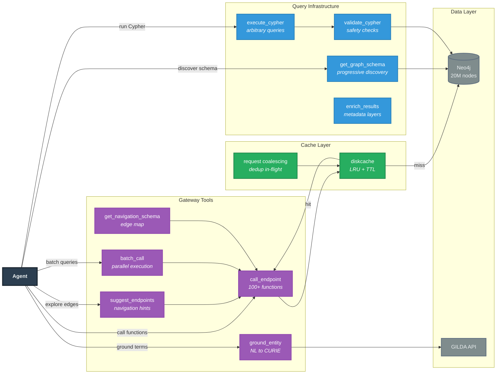

# INDRA Agent

MCP server for the INDRA CoGEx biomedical knowledge graph.

Gives AI agents access to 20M+ nodes spanning genes, diseases, drugs, pathways, and their causal relationships — assembled from scientific literature and curated databases by [INDRA](https://indra.bio) (Integrated Network and Dynamical Reasoning Assembler).

Replaces 100+ individual function tools with **9 composable tools** that expose the full power of the knowledge graph while maintaining safety and usability.

## Quick Start

**Public server** — no installation needed:

```json
{
  "mcpServers": {
    "indra-cogex": {
      "url": "https://discovery.indra.bio/mcp"
    }
  }
}
```

Add this to your MCP client config ([Claude Desktop](https://claude.ai/download), [Claude Code](https://docs.anthropic.com/en/docs/claude-code), Cursor, etc.) and start asking questions about genes, diseases, and drugs.

**Local installation** — for development or private Neo4j instances:

```bash
pip install git+https://github.com/gyorilab/indra_agent.git
```

## Connection Modes

| | Stdio (local) | HTTP (remote) |
|---|---|---|
| **Use case** | Claude Desktop, Cursor, Claude Code | Deployed server, shared access |
| **Config key** | `"command": "indra-agent"` | `"url": "https://..."` |
| **Neo4j credentials** | Required locally (env vars) | Configured server-side |
| **Scaling** | Single process | Multi-worker (gunicorn) |

### Stdio Mode (Default)

For local MCP clients:

```bash
# Via console script
indra-agent

# Or via module
python -m indra_agent.mcp_server
```

Claude Desktop config (`~/Library/Application Support/Claude/claude_desktop_config.json`):

```json
{
  "mcpServers": {
    "indra-cogex": {
      "command": "indra-agent",
      "env": {
        "INDRA_NEO4J_URL": "bolt://your-server:7687",
        "INDRA_NEO4J_USER": "neo4j",
        "INDRA_NEO4J_PASSWORD": "your-password",
        "MCP_ALLOWED_HOSTS": "localhost",
        "MCP_ALLOWED_ORIGINS": "http://localhost"
      }
    }
  }
}
```

### HTTP Mode

For network deployments:

```bash
indra-agent --http
indra-agent --http --host 0.0.0.0 --port 8000
indra-agent --http --stateful --streaming
```

Production (gunicorn):

```bash
gunicorn indra_agent.mcp_server.server:app \
  --bind 0.0.0.0:8778 \
  --worker-class uvicorn.workers.UvicornWorker \
  -w 4
```

## Tools

**9 tools** in two groups:

### Gateway Tools (5 tools)

High-level graph navigation — most agents start here:

| Tool | Purpose |
|------|---------|
| `ground_entity` | Natural language to CURIE with semantic filtering. Supports single term or batch mode. |
| `suggest_endpoints` | Given CURIEs, suggest reachable entity types and traversal functions |
| `call_endpoint` | Execute any of 100+ autoclient functions with auto-grounding, caching, and xref fallback |
| `get_navigation_schema` | Full edge map showing how entity types connect. Optional `entity_type` filter. |
| `batch_call` | Execute an endpoint for multiple entities in one call. Routes to native batch queries where available. |

### Query Infrastructure (4 tools)

Low-level Cypher access for complex queries:

| Tool | Purpose |
|------|---------|
| `get_graph_schema` | Discover entity types, relationships, patterns |
| `execute_cypher` | Run arbitrary Cypher with parameterization |
| `validate_cypher` | Pre-flight safety validation |
| `enrich_results` | Add metadata at configurable disclosure levels |

### `call_endpoint` Parameters

The primary query tool supports several optimization parameters:

| Parameter | Type | Description |
|-----------|------|-------------|
| `endpoint` | str | Function name (e.g., `"get_diseases_for_gene"`) |
| `kwargs` | str | JSON arguments. Entities as CURIE tuples `{"gene": ["HGNC", "6407"]}` or natural language `{"gene": "LRRK2"}` |
| `auto_ground` | bool | Auto-ground string params to CURIEs (default: True) |
| `disclosure_level` | str | Enrich results: `"standard"` (~250 tokens/item), `"detailed"` (~400), `"exploratory"` (~750) |
| `offset` | int | Pagination offset. Use `next_offset` from previous response to continue. |
| `limit` | int | Max items per page. Auto-truncates to ~20k tokens if exceeded. |
| `fields` | list | Project results to specific keys (e.g., `["db_ns", "db_id", "name"]`). Reduces token usage. |
| `estimate` | bool | Probe query cost before fetching. Returns count, token estimate, available fields, sample. |
| `sort_by` | str | `"evidence"` (most-validated first) or `"name"` (alphabetical). Applied before pagination. |
| `include_navigation` | bool | Append suggested next traversal steps to results. |

### `batch_call` Parameters

| Parameter | Type | Description |
|-----------|------|-------------|
| `endpoint` | str | Function name (e.g., `"get_diseases_for_gene"`) |
| `entity_param` | str | Which parameter to batch over (e.g., `"gene"`) |
| `entity_values` | list | Entity values to query (e.g., `["SIRT3", "PRKN", "MAPT"]`). Auto-grounded. |
| `fields` | list | Project results to specific keys per item |
| `max_concurrent` | int | Max parallel queries (default: 10) |
| `merge_strategy` | str | `"keyed"` (default): `{entity: results}` dict. `"flat"`: concatenated list. |

For `get_drugs_for_target` and `get_targets_for_drug`, batch_call automatically routes to native batch functions that use a single Neo4j `WHERE IN` query instead of N separate queries.

## Architecture



Most agents use Gateway Tools — ground natural language to CURIEs, then call pre-built functions. When predefined functions cannot express the query (graph algorithms, multi-hop traversals, conditional aggregations), agents drop down to Query Infrastructure.

### Context-Aware Grounding

Parameter semantics encode entity type, eliminating cross-type ambiguity:

```python
ground_entity(term="ALS", param_name="disease")
# → MESH:D000690 (Amyotrophic Lateral Sclerosis)

ground_entity(term="ALS", param_name="gene")
# → HGNC:396 (SOD1, formerly ALS1)

ground_entity(term="aspirin", param_name="drug")
# → CHEBI:15365
```

Supported `param_name` filters: `disease`, `gene`, `drug`, `pathway`, `tissue`, `cell_line`, `cell_type`, `side_effect`.

**Batch mode** grounds multiple terms in one call:

```python
ground_entity(terms=["SIRT3", "PRKN", "MAPT"], param_name="gene")
# → {mappings: {"SIRT3": {curie, name, score}, ...}, failed: [...]}
```

**Organism context** accepts common names or taxonomy IDs:

```python
ground_entity(term="LRRK2", organism="human")   # resolved to 9606
ground_entity(term="LRRK2", organism="9606")     # passthrough
ground_entity(term="Trp53", organism="mouse")    # resolved to 10090
```

### Cross-Reference Fallback

When a grounded query returns zero results, `call_endpoint` automatically looks up equivalent identifiers via `xref` relationships in the graph and retries. This handles cases where GILDA grounds to one namespace (e.g., MESH) but the relevant data is indexed under another (e.g., DOID).

### Caching

All `call_endpoint` results are cached via a `diskcache.FanoutCache`:

- **Cross-process safe** — SQLite backend, works with gunicorn multi-worker
- **LRU eviction** — configurable max size (default 2GB)
- **Per-key TTL** — default 1 hour, schema cached for 24 hours
- **Request coalescing** — concurrent identical requests share a single Neo4j query
- Cache stores raw results; sort, field projection, and pagination are applied post-cache

### Safety

- **Validation layer** prevents all write/mutate operations (DELETE, CREATE, MERGE, SET, REMOVE, DROP, DETACH)
- **Parameterized queries** prevent injection attacks
- **Neo4j `execute_read()`** enforces read-only semantics at the driver level

### Token-Aware Pagination

Large result sets are automatically truncated with continuation hints:

```python
{
  "results": [...],
  "pagination": {
    "total": 1500,
    "returned": 127,
    "has_more": true,
    "next_offset": 127
  }
}
```

Use `estimate=True` to probe query cost before fetching:

```python
call_endpoint("get_drugs_for_target", '{"target": "EGFR"}', estimate=True)
# → {result_count: 78, token_estimate_full: 15200, fields_available: [...], sample: [...]}
```

Then fetch with projection:

```python
call_endpoint("get_drugs_for_target", '{"target": "EGFR"}', fields=["db_ns", "db_id", "name"], limit=50)
```

## Configuration

### Neo4j Credentials

```bash
export INDRA_NEO4J_URL="bolt://localhost:7687"
export INDRA_NEO4J_USER="neo4j"
export INDRA_NEO4J_PASSWORD="your-password"
```

Or configure in `~/.config/indra/config.ini` (the standard INDRA config file).

### Transport Security (Required)

| Variable | Required | Description |
|----------|----------|-------------|
| `MCP_ALLOWED_HOSTS` | Yes | Comma-separated allowed hosts (e.g., `localhost,discovery.indra.bio`) |
| `MCP_ALLOWED_ORIGINS` | Yes | Comma-separated allowed origins (e.g., `http://localhost:3000,https://discovery.indra.bio`) |

### Cache

| Variable | Default | Description |
|----------|---------|-------------|
| `INDRA_CACHE_DIR` | `~/.cache/indra_cogex_mcp` | Cache directory path |
| `INDRA_CACHE_SIZE_MB` | `2048` | Max cache size in MB (LRU eviction beyond this) |
| `INDRA_CACHE_TTL` | `3600` | Default TTL in seconds |
| `INDRA_CACHE_SHARDS` | `4` | FanoutCache shards (higher = better concurrency, more file handles) |

### HTTP Mode

| Variable | Default | Description |
|----------|---------|-------------|
| `MCP_HOST` | `0.0.0.0` | Host to bind in HTTP mode |
| `MCP_PORT` | `8000` | Port to bind in HTTP mode |

## Development

```bash
git clone https://github.com/gyorilab/indra_agent.git
cd indra_agent
pip install -e ".[dev]"

# Run tests
pytest tests/

# Run specific test file
pytest tests/mcp_server/test_gateway_tools.py -v
```

## Dependencies

- `indra_cogex` — INDRA CoGEx knowledge graph client
- `mcp>=1.2.0` — Model Context Protocol SDK (requires 1.2.0+ for transport security)
- `gilda` — Biomedical entity grounding
- `diskcache>=5.6` — Persistent caching with LRU eviction
- `pydantic>=2.0` — Data validation
- `click>=8.0` — CLI framework
- `starlette>=0.27.0` — ASGI framework
- `uvicorn>=0.20.0` — ASGI server (HTTP mode)
- `jinja2>=3.0.0` — Template engine

## License

BSD-2-Clause
