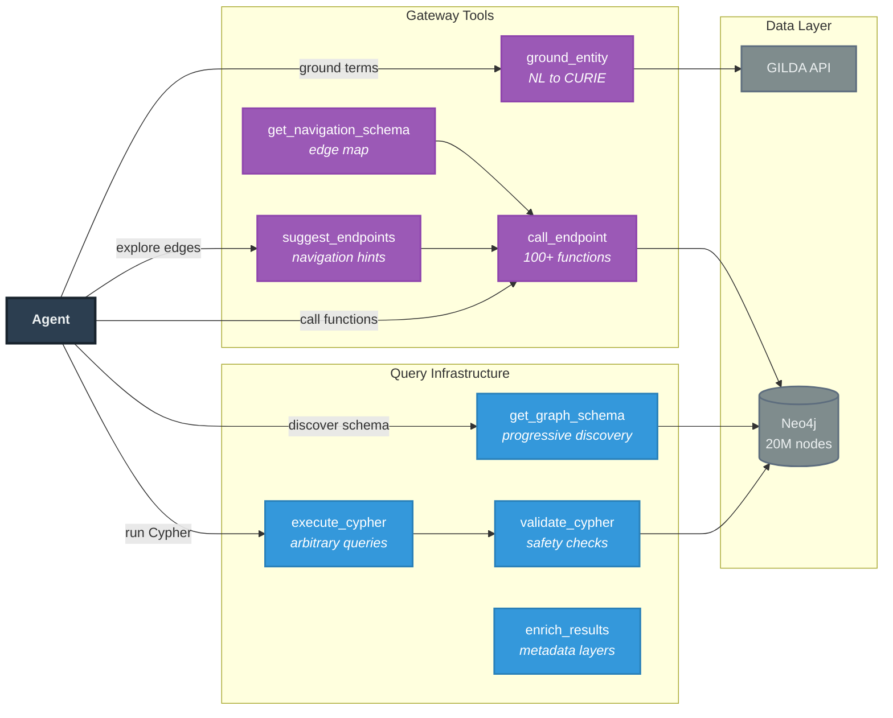

# INDRA Agent

MCP server and agent tools for INDRA CoGEx knowledge graph exploration.

Enables AI agents to explore biomedical knowledge through the Model Context Protocol (MCP). Replaces 100+ individual function tools with 8 composable tools that expose the full power of Cypher queries while maintaining safety and usability.

## Installation

Requires **Python >= 3.10**.

```bash
pip install git+https://github.com/gyorilab/indra_agent.git
```

Or from source:

```bash
git clone https://github.com/gyorilab/indra_agent.git
cd indra_agent
pip install -e ".[dev]"
```

## Configuration

### Neo4j Credentials

Set Neo4j credentials via environment variables:

```bash
export INDRA_NEO4J_URL="bolt://localhost:7687"
export INDRA_NEO4J_USER="neo4j"
export INDRA_NEO4J_PASSWORD="your-password"
```

Or configure them in `~/.config/indra/config.ini` (the standard INDRA config file).

### Transport Security (Required)

The server requires `MCP_ALLOWED_HOSTS` and `MCP_ALLOWED_ORIGINS` to be set. Without these, the server will not start.

| Variable | Required | Description |
|----------|----------|-------------|
| `MCP_ALLOWED_HOSTS` | Yes | Comma-separated allowed hosts (e.g., `localhost,discovery.indra.bio`) |
| `MCP_ALLOWED_ORIGINS` | Yes | Comma-separated allowed origins (e.g., `http://localhost:3000,https://discovery.indra.bio`) |

```bash
export MCP_ALLOWED_HOSTS="localhost,discovery.indra.bio"
export MCP_ALLOWED_ORIGINS="http://localhost:3000,https://discovery.indra.bio"
```

### HTTP Mode

| Variable | Default | Description |
|----------|---------|-------------|
| `MCP_HOST` | `0.0.0.0` | Host to bind in HTTP mode |
| `MCP_PORT` | `8000` | Port to bind in HTTP mode |

### Cache

| Variable | Default | Description |
|----------|---------|-------------|
| `INDRA_CACHE_DIR` | `~/.cache/indra_cogex_mcp` | Cache directory path |
| `INDRA_CACHE_SIZE_MB` | `2048` | Max cache size in MB |
| `INDRA_CACHE_TTL` | `3600` | Default TTL in seconds |
| `INDRA_CACHE_SHARDS` | `4` | Number of cache shards |

## Usage

### Stdio Mode (Default)

For local clients like Claude Desktop and Cursor:

```bash
# Via console script
indra-agent

# Or via module
python -m indra_agent.mcp_server
```

### HTTP Mode

For network access:

```bash
# Run in HTTP mode
indra-agent --http

# Custom host and port
indra-agent --http --host 0.0.0.0 --port 8000

# Stateful with SSE streaming
indra-agent --http --stateful --streaming
```

### Claude Desktop Configuration

Add to `~/Library/Application Support/Claude/claude_desktop_config.json`:

```json
{
  "mcpServers": {
    "indra-cogex": {
      "command": "indra-agent",
      "env": {
        "INDRA_NEO4J_URL": "bolt://your-server:7687",
        "INDRA_NEO4J_USER": "neo4j",
        "INDRA_NEO4J_PASSWORD": "your-password",
        "MCP_ALLOWED_HOSTS": "localhost",
        "MCP_ALLOWED_ORIGINS": "http://localhost"
      }
    }
  }
}
```

## Tools

**8 tools** organized into two groups:

### Gateway Tools (4 tools)
High-level graph navigation -- most agents start here:

| Tool | Purpose |
|------|---------|
| `ground_entity` | Natural language to CURIE with semantic filtering |
| `suggest_endpoints` | Given CURIEs, suggest reachable entity types and functions |
| `call_endpoint` | Execute any of 100+ autoclient functions with auto-grounding |
| `get_navigation_schema` | Full edge map showing how entity types connect |

### Query Infrastructure (4 tools)
Low-level Cypher access for complex queries:

| Tool | Purpose |
|------|---------|
| `get_graph_schema` | Discover entity types, relationships, patterns |
| `execute_cypher` | Run arbitrary Cypher with parameterization |
| `validate_cypher` | Pre-flight safety validation |
| `enrich_results` | Add metadata at configurable disclosure levels |

## Architecture



Most agents use Gateway Tools -- ground natural language to CURIEs, then call pre-built functions. When predefined functions cannot express the query (graph algorithms, multi-hop traversals, conditional aggregations), agents drop down to Query Infrastructure: discover schema, execute Cypher with validation, enrich results.

### Context-Aware Grounding

Parameter semantics encode entity type. When `call_endpoint` receives `disease="ALS"`, it filters GILDA results to disease namespaces:

```python
ground_entity(term="ALS", param_name="disease")
# Returns: MESH:D000690 (Amyotrophic Lateral Sclerosis)

ground_entity(term="ALS", param_name="gene")
# Returns: HGNC:396 (SOD1, formerly ALS1)
```

### Safety

- **Validation layer** prevents all write/mutate operations (DELETE, CREATE, MERGE, SET, REMOVE, DROP, DETACH)
- **Parameterized queries** prevent injection attacks
- **Neo4j `execute_read()`** enforces read-only semantics at the driver level

### Token-Aware Pagination

Large result sets are automatically truncated with continuation hints:

```python
{
  "results": [...],
  "pagination": {
    "total": 1500,
    "returned": 127,
    "has_more": true,
    "next_offset": 127
  },
  "continuation_hint": "To get more, call with offset=127"
}
```

## Development

```bash
# Install with dev dependencies
pip install -e ".[dev]"

# Run tests
pytest tests/

# Run specific test file
pytest tests/mcp_server/test_gateway_tools.py -v
```

## Dependencies

- `indra_cogex` - INDRA CoGEx knowledge graph client
- `mcp>=1.2.0` - Model Context Protocol SDK
- `gilda` - Biomedical entity grounding
- `pydantic>=2.0` - Data validation
- `click>=8.0` - CLI framework
- `starlette>=0.27.0` - ASGI framework
- `uvicorn>=0.20.0` - ASGI server (HTTP mode)
- `jinja2>=3.0.0` - Template engine
- `diskcache>=5.6` - Persistent caching

## License

BSD-2-Clause
